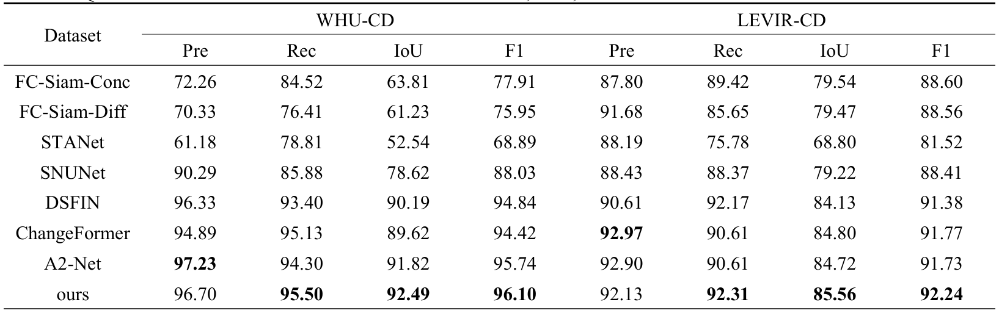

# <p align=center>`FDA-FFNet: A Feature-Distance Attention-Based Change Detection Network for Remote Sensing Image (IEEE JSTARS 2023)`</p>

> **Authors:**
Wenguang Peng(WHU); Wenzhong Shi,Min Zhang(PolyU); Lukang Wang (CUMT)

our paper [FDA-FFNet](https://ieeexplore.ieee.org/abstract/document/10365491).
### 1. Overview

<p align="center">
     <br />
</p>
The proposed model follows an encoder-decoder structure, illustrated in Figure 1. The encoder is composed of a weight-sharing twin ResNet, SPPF, and FDA-FFM. On the other hand, the decoder, known as the change analysis network, utilizes using Stepwise upsampling convolutional networks and a DSAM to obtains the CD results. 

### 2. data prepare
+ Prepare the data:
    - Download datasets [LEVIR](https://justchenhao.github.io/LEVIR/), [WHUCD](https://study.rsgis.whu.edu.cn/pages/download/building_dataset.html).
    - Crop LEVIR and BCDD datasets into 256x256 patches. 
    - Prepare datasets into the following structure and set their path in `train.py` and `test.py`
    ```
    ├─Train
        ├─A        ...jpg/png
        ├─B        ...jpg/png
        ├─label    ...jpg/png
    ├─Val
        ├─A
        ├─B
        ├─label
    ├─Test
        ├─A
        ├─B
        ├─label

### 3. usage
+ Prerequisites for Python:
    - Creating a virtual environment in the terminal: `conda create -n (name) python=3.6,9`
    - Activate the environment: `conda activate (name)`
    - Installing necessary packages: `pip install -r requirements.txt `

+ Train/Test
    - `python ./train.py`
    - `python ./test.py`

### 4.  Results
<p align="center">
    <em> 
    QUANTITATIVE COMPARISONS IN TERMS OF PRE, REC, IOU and F1 ON TWO RSCD DATASETS <font color="#FF0000">red</font> and <font color="#00B0F0">blue</font>, respectively.
    </em>
     <br />
     <br />
    <em> 
    Visual comparisons of the proposed method and the state-of-the-art approaches on the LEVIR-CD and WHU-CD dataset. (a) t1 images. (b) t2 images. (c) Ground truth. (d) FC-Siam-Conc. (e) FC-Siam-Diff. (f) SNUNet. (g) DSFIN. (h) ChangeFormer. (i) A2-Net. (j) Ours. The rendered colors represent true positives (white), false positives (red), true negatives (black), and false negatives (blue).<font color="#FF0000">red</font> and <font color="#00B0F0">blue</font>
    </em>
    
</p>

### 5. Citation

Please cite our paper if you find the work useful:

    @ARTICLE{
        10365491,
    author={Peng, Wenguang and Shi, Wenzhong and Zhang, Min and Wang, Lukang},
    journal={IEEE Journal of Selected Topics in Applied Earth Observations and Remote Sensing}, 
    title={FDA-FFNet: A Feature-Distance Attention-Based Change Detection Network for Remote Sensing Image}, 
    year={2024},
    volume={17},
    number={},
    pages={2224-2233},
    keywords={Feature extraction;Image segmentation;Remote sensing;Euclidean distance;Surveillance;Support vector machines;Standards;Attention-based;change detection (CD);deep learning;deep supervision;multiscale feature},
    doi={10.1109/JSTARS.2023.3344633}
    }
